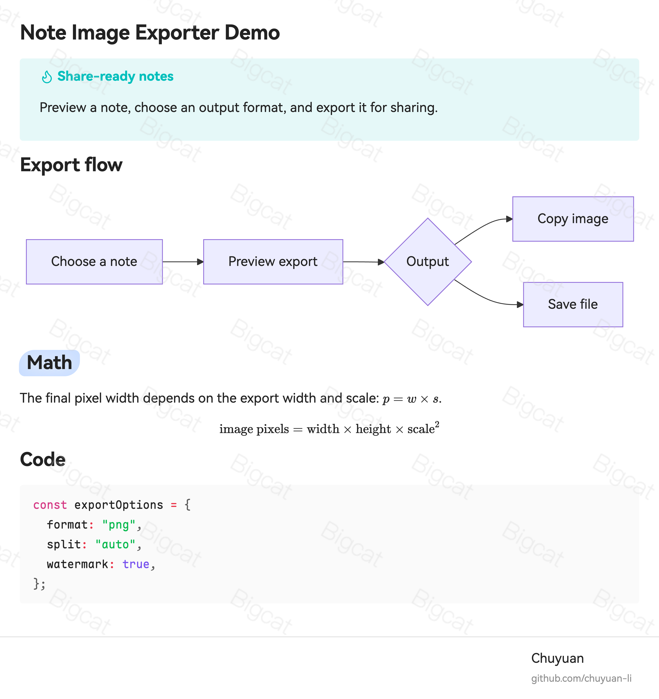
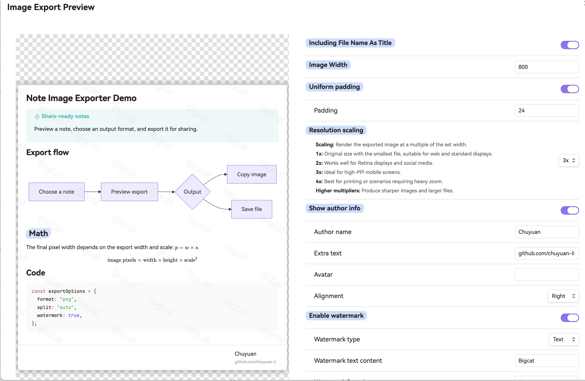

# Note Image Exporter

[English](README.md) | 中文

将 Obsidian 笔记、选中文本和文件夹导出为便于分享的图片或 PDF，并支持实时预览、长图拆分、水印和作者信息。



Note Image Exporter 会尽量保留 Obsidian 的渲染结果，因此导出的图片可以包含 Mermaid 图表、数学公式、代码块、Callout、元数据和当前笔记样式。

## 快速开始

1. 右键点击笔记、选中文本或文件夹。
2. 选择 **Export to image**、**Export selection to image** 或 **Export all notes to image**。
3. 在预览中调整效果，然后复制结果或保存为文件。



## 功能

- 将笔记导出为 PNG、JPG、WebP 或 PDF。
- 在格式支持时，直接从导出预览复制图片。
- 导出前实时预览宽度、内边距、格式、分辨率、水印和作者信息等效果。
- 使用固定高度、水平分割线或按段落自动拆分长笔记。
- 为分享图片添加文本水印或图片水印。
- 在导出图片像素中嵌入隐藏资产标识，便于后续匹配。
- 在导出图片中添加作者名、附加文本、头像，并设置对齐方式和显示位置。
- 从文件菜单批量导出文件夹中的 Markdown 笔记。
- 使用插件提供的 20 种界面语言。

## 使用方式

### 导出笔记

- 在文件列表中右键点击 Markdown 文件，选择 **Export to image**。
- 在编辑器中右键，选择 **Export to image**。
- 打开命令面板，运行 **Export as an image**。

### 导出选中文本

- 在编辑器中选中 Markdown 内容。
- 右键选择 **Export selection to image**，或在命令面板中运行对应命令。
- 如果希望用更少步骤复制选中内容，可以在插件设置中开启快速导出选区。

### 导出文件夹

- 在文件列表中右键点击文件夹，选择 **Export all notes to image**。
- 在批量导出窗口中选择需要导出的笔记。

## 导出选项

### 输出格式

| 格式 | 适用场景 |
| --- | --- |
| PNG | 默认图片格式。需要透明背景时可选择透明 PNG。 |
| JPG | 不需要透明背景、希望文件更小时使用。 |
| WebP | 在目标平台支持时，用于获得更紧凑的图片输出。 |
| PDF | 基于导出笔记图片生成单页 PDF。 |

### 拆分模式

| 模式 | 行为 |
| --- | --- |
| 不拆分 | 导出为一张图片。 |
| 固定高度 | 按页面高度拆分，并可设置相邻图片的重叠区域。 |
| 水平分割线 | 在 Markdown 水平分割线（例如 `---`）处拆分。 |
| 自动 | 尽量在段落边界附近拆分，并接近设置的页面高度。 |

### 布局和装饰

- 根据分享场景设置导出宽度和分辨率缩放。
- 使用统一内边距，或分别设置上、右、下、左内边距。
- 在需要时将文件名显示为导出图片标题。
- 在需要展示 frontmatter 时包含元数据。
- 将作者信息放在笔记上方或下方，并设置左对齐、居中或右对齐。

总输出缩放会被限制在 4x 以内，以减少导出大型笔记时的内存压力。

## 平台说明

- 在桌面端，保存的导出结果会作为文件下载。
- 在移动端，保存的导出结果会写入当前 vault。
- 是否支持复制到剪贴板取决于输出格式和平台；无法复制时请保存文件。

## 安装

### 社区插件

插件上架后，可在 Obsidian 社区插件中安装 **Note Image Exporter**。

### 手动安装

1. 从 release 下载 `main.js`、`manifest.json` 和 `styles.css`。
2. 将它们放入 `<Vault>/.obsidian/plugins/note-image-exporter/`。
3. 在 **Settings** -> **Community plugins** 中启用 **Note Image Exporter**。

## 隐私和网络请求

笔记内容会在本地渲染并导出。插件不会将笔记内容发送到服务端。

只有当你为导出资源提供远程图片 URL 时，插件才会读取该远程图片，例如图片水印或头像。如果不希望导出时读取远程图片，请使用 vault 中的本地图片或上传的图片。

## 开发

```bash
npm install
npm run dev
npm run build
npm run typesafe-i18n
```

## 作者

由 [chuyuan-li](https://github.com/chuyuan-li) 创建。

## 许可证

MIT
